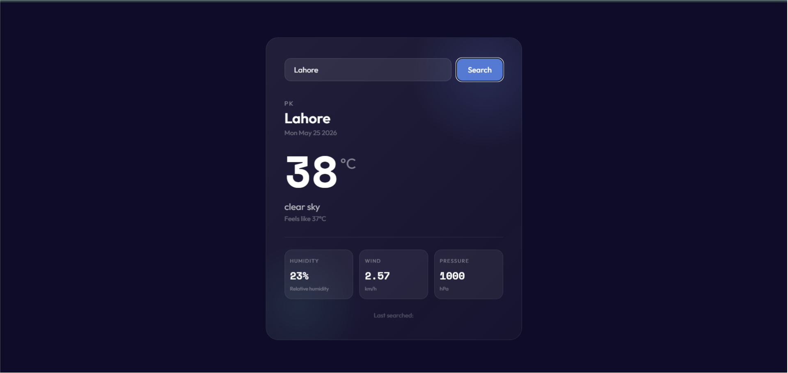
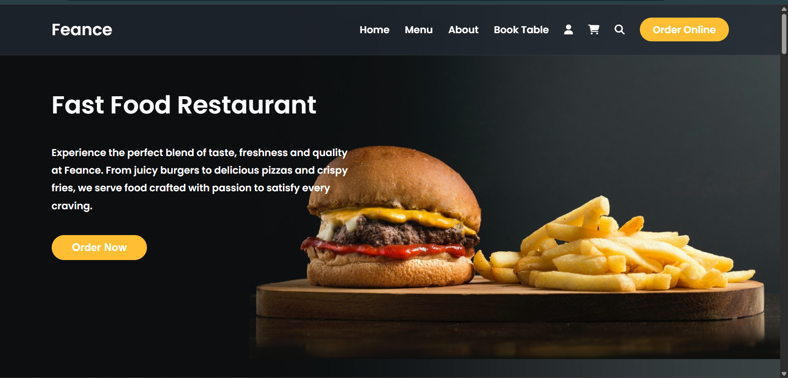

# Muhammad Farhan — Frontend Developer Portfolio 🚀

A modern and responsive frontend developer portfolio showcasing my latest UI/UX projects, frontend development skills and responsive web applications.

## 🌐 Live Preview

[View Portfolio](https://farhan-dev-portfolio.netlify.app/)

---

## ✨ Featured Projects

### 🌦️ Weather App

[Live Demo](https://magical-dasik-d81b09.netlify.app/)



A modern glassmorphism-based weather application providing real-time weather updates with a clean dark-themed interface.

**Features**

* Real-time weather search
* Responsive design
* Glassmorphism UI
* Dark mode aesthetics
* Dynamic weather data

**Technologies Used**

* HTML5
* CSS3
* JavaScript
* Weather API

---

### 🐦 X (Twitter) Clone

[Live Demo](https://xclone-twitter.netlify.app/)


A responsive social media interface inspired by modern social platforms with a clean and scalable UI layout.

**Features**

* Responsive layout
* Dark mode interface
* Sidebar navigation
* Simulated feed system
* Modern UI/UX structure

**Technologies Used**

* HTML5
* Tailwind CSS
* JavaScript

---

### 🍽️ Feacne Restaurant Website

[Live Demo](https://statuesque-douhua-60ec9b.netlify.app/)



A premium restaurant landing page designed with a modern dark aesthetic and interactive user experience.

**Features**

* Modern hero section
* Responsive navigation
* Interactive UI
* Food showcase sections
* Smooth user experience

**Technologies Used**

* HTML5
* CSS3
* JavaScript

---

## 🚀 Portfolio Features

* Fully Responsive Design
* Modern Dark UI
* Smooth Scrolling
* Interactive Components
* Project Showcase Modals
* Clean File Structure
* Optimized User Experience
* Glassmorphism UI

---

## 🛠️ Technologies Used

* HTML5
* CSS3
* JavaScript
* Responsive Web Design

---

## 📂 Folder Structure

```text
assets/
├── css/
├── js/
├── images/

index.html
script.js
README.md
```

---

## 🎯 Learning Outcomes

This portfolio helped me improve my skills in:

* Frontend Architecture
* Responsive Development
* UI/UX Design
* JavaScript DOM Manipulation
* Modern Web Layouts
* Clean Code Practices

---

## 🔮 Future Improvements

* React Version
* API Integrations
* Better Animations
* Backend Connectivity
* Advanced Interactive Components

---

## 👨‍💻 Author

**Muhammad Farhan**

Frontend Developer passionate about building modern, responsive and user friendly web experiences.

### 📫 Connect With Me

* GitHub: https://github.com/Fury85
* LinkedIn: https://www.linkedin.com/in/muhammad-farhan-5557303b6/